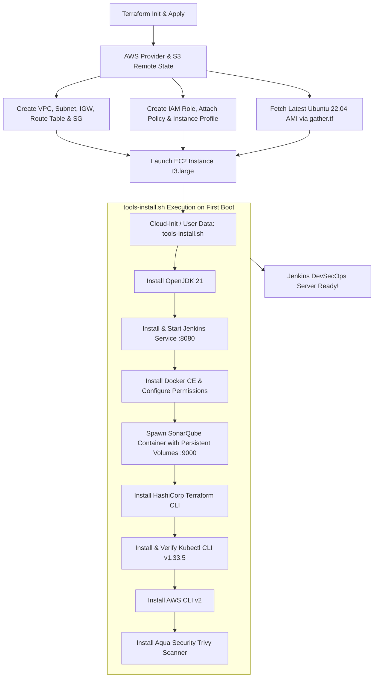

# Jenkins Server Provisioning Guide

This guide provides a comprehensive, step-by-step walkthrough of how the Jenkins DevSecOps controller server is provisioned, bootstrapped, and configured using Terraform and User Data automation.

---

## 1. Architecture & Provisioning Flow



---

## 2. Prerequisites Before Provisioning

Before executing Terraform, ensure the following are in place:

1. **AWS CLI & Credentials**:
   - Configured with necessary AWS IAM permissions (`aws configure`).
2. **S3 Backend Bucket**:
   - S3 Bucket `dev-aman-tf-bucket` must exist in `us-east-1` (defined in `backend.tf`).
3. **AWS EC2 Key Pair**:
   - An EC2 Key Pair named `Aman-Pathak` (or the name defined in `variables.tfvars`) must exist in your AWS `us-east-1` region for SSH access.
4. **Terraform CLI**:
   - Version `>= 1.13.3` installed locally.

---

## 3. Step-by-Step Provisioning Instructions

### Step 1: Navigate to the Directory
```bash
cd c:/STUDY/DevOps/DevSecOps_Project_EKS_Jenkins_Terraform_ArgoCD/jenkins-server
```

### Step 2: Initialize Terraform Backend & Providers
```bash
terraform init
```
- Connects to the remote S3 bucket `dev-aman-tf-bucket` for state storage with S3 native locking.
- Downloads the `hashicorp/aws` provider plugin (version `>= 6.23.0`).

### Step 3: Format & Validate Configurations
```bash
terraform fmt
terraform validate
```

### Step 4: Preview Infrastructure Execution Plan
```bash
terraform plan -var-file="variables.tfvars"
```
> **Note**: Because the variables file is named `variables.tfvars` rather than the default `terraform.tfvars`, you must pass the `-var-file` flag (or rename it to `terraform.tfvars` / `terraform.auto.tfvars` for automatic loading).

### Step 5: Apply Infrastructure
```bash
terraform apply -var-file="variables.tfvars" --auto-approve
```

Upon successful deployment, Terraform will display structured outputs defined in `output.tf`:
- `ec2_public_ip`: Public IP address of the Jenkins server.
- `ssh_connection_command`: Pre-formatted command to SSH into the instance.
- `jenkins_url`: Direct browser link (`http://<IP>:8080`).
- `sonarqube_url`: Direct browser link (`http://<IP>:9000`).
- `jenkins_initial_admin_password_command`: Direct command to fetch the Jenkins unlock secret.
- `vpc_id`, `subnet_id`, `security_group_id`: Core networking resource IDs.

---

## 4. What Happens During Provisioning (Behind the Scenes)

1. **Networking Layer Creation (`vpc.tf`)**:
   - Provisions VPC `Jenkins-vpc` (`10.0.0.0/16`).
   - Attaches Internet Gateway `Jenkins-igw`.
   - Creates Public Subnet `Jenkins-subnet` (`10.0.1.0/24`) in `us-east-1a` with auto-assign public IPv4 enabled.
   - Sets Route Table `Jenkins-route-table` with default route `0.0.0.0/0 -> IGW` and associates it with the public subnet.
   - Configures Security Group `Jenkins-sg` permitting ingress on ports `22` (SSH), `8080` (Jenkins), and `9000` (SonarQube).

2. **IAM Layer Creation (`iam-*.tf`)**:
   - Creates IAM Role `Jenkins-iam-role` with EC2 trust policy.
   - Attaches the IAM policy (`AdministratorAccess`) to the role.
   - Creates IAM Instance Profile `Jenkins-instance-profile` and links it to the role.

3. **AMI Resolution (`gather.tf`)**:
   - Dynamically searches AWS for the most recent official Canonical Ubuntu 22.04 LTS HVM-SSD AMD64 server AMI.

4. **EC2 Instance Launch & User Data Execution (`ec2.tf`)**:
   - Launches an EC2 instance (`t3.large`) with:
     - 50 GB `gp3` encrypted root volume.
     - IMDSv2 metadata enforcement (`http_tokens = "required"`).
     - IAM instance profile attached.
   - AWS Cloud-Init triggers `tools-install.sh` in the background as the `root` user upon initial system startup.

---

## 5. Software Installation Breakdown (`tools-install.sh`)

When the instance boots, `tools-install.sh` executes automatically in sequence:

| Step | Component | Action | Verification |
| :--- | :--- | :--- | :--- |
| **1** | **Java** | Installs `fontconfig` & `openjdk-21-jre`. | `java --version` |
| **2** | **Jenkins** | Adds Jenkins repository key, installs package, registers `systemd` service on port `8080`. | `sudo systemctl status jenkins` |
| **3** | **Docker** | Installs `docker.io`, adds `jenkins` and `ubuntu` to `docker` group, restarts daemon. | `docker --version` |
| **4** | **SonarQube** | Creates persistent volumes (`sonarqube_data`, `sonarqube_extensions`, `sonarqube_logs`) and launches SonarQube container on port `9000`. | `docker ps` |
| **5** | **Terraform** | Adds HashiCorp official APT keyring and installs `terraform` CLI. | `terraform --version` |
| **6** | **Kubectl** | Downloads `kubectl` v1.33.5 binary, verifies SHA-256 checksum, moves to `/usr/local/bin/kubectl`. | `kubectl version --client` |
| **7** | **AWS CLI v2** | Downloads AWS CLI v2 zip bundle, unzips, and runs official `./aws/install`. | `aws --version` |
| **8** | **Trivy** | Adds Aqua Security repository and installs `trivy` container/filesystem vulnerability scanner. | `trivy --version` |

---

## 6. Accessing & Configuring Services Post-Provisioning

### 1. Monitor User Data Progress
SSH into the EC2 instance using your private key:
```bash
ssh -i "Aman-Pathak.pem" ubuntu@<EC2_PUBLIC_IP>
```
Check the user-data script execution logs:
```bash
tail -f /var/log/cloud-init-output.log
```

### 2. Access Jenkins Web Console
- **URL**: `http://<EC2_PUBLIC_IP>:8080`
- **Initial Admin Password**: Retrieve from the instance via SSH:
  ```bash
  sudo cat /var/lib/jenkins/secrets/initialAdminPassword
  ```
- Follow the on-screen wizard to install suggested plugins and create your admin account.

### 3. Access SonarQube Web Console
- **URL**: `http://<EC2_PUBLIC_IP>:9000`
- **Default Credentials**:
  - **Username**: `admin`
  - **Password**: `admin` (You will be prompted to change this upon first login).

---

## 7. Destroying the Infrastructure

To tear down all AWS resources created by this Terraform module to prevent ongoing costs:
```bash
terraform destroy -var-file="variables.tfvars" --auto-approve
```
